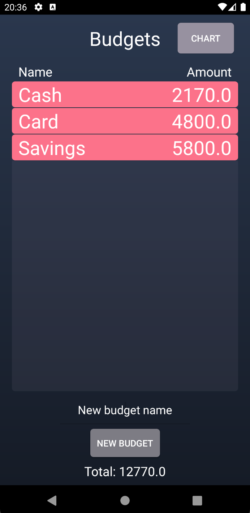
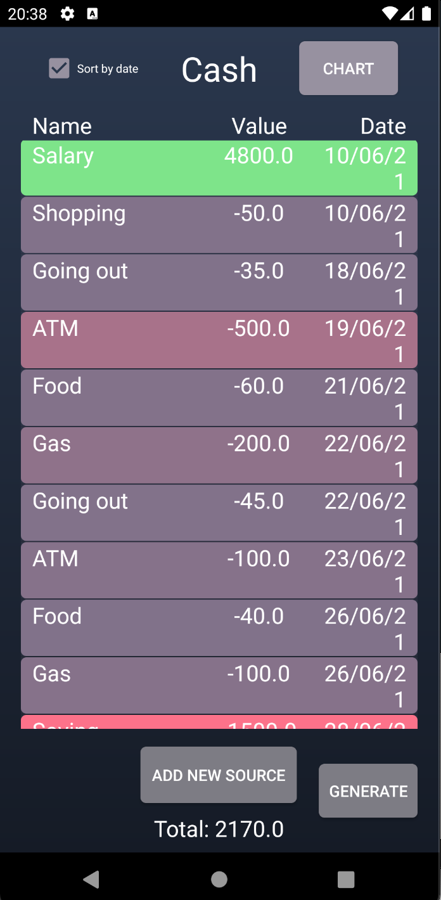
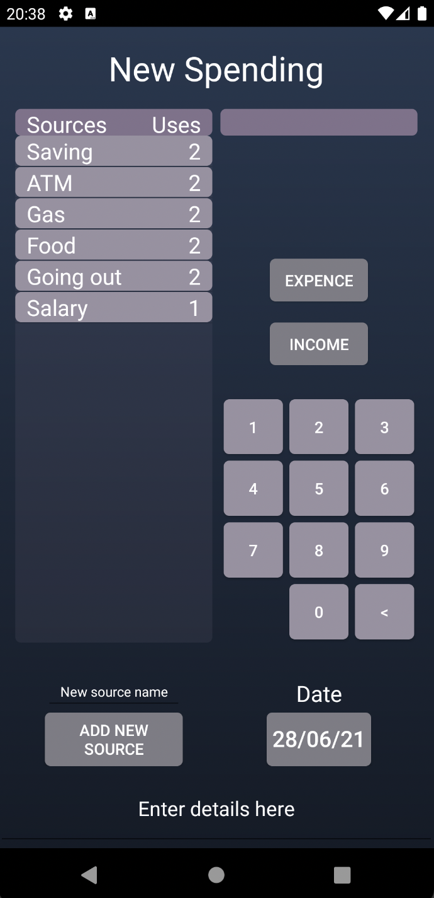

# Spender

<h1> Description </h1>
  
 An Android app that helps you manage your founds and see your money spending habbits. An interactive design helps you add new expenses or incomes in different accounts, created by you. Each transaction has its own category, date and can have its own description.

<h1>Preview<h1>
<h2>Selecting a budget<h2>

<h2>Checking your spendings<h2>

<h2>Adding a new spending<h2>

  

<h1> Author </h1>

Lorin Budaca - lorinbudaca@gmail.com

<h1> Collaborator </h1>

Tudor Craciun - tudor.craciun1@gmail.com

  
